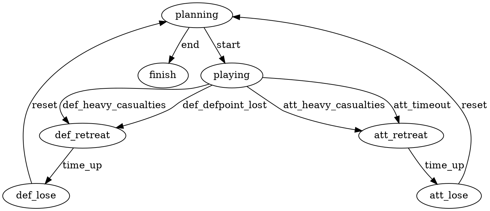

# TvT_Defense_In_Depth

## how to play

* match FSM goes to "planning"
* admin selects attack corridor by putting two markers denoting two corners of a rectangular area
    * server draws some rectangular markers to make rectangle visible
* admin selects defense point (which is also defenders' spawn point)
* server defines attackers' spawn point by selecting the point on the attack corridor farthest away from defense point
* players are spawned
* match FSM goes to "playing"

## how to end

* while in "planning", admin may use "`#end`" command

## match FSM

## misc

* player leaving the attack corridor through the flanks (or the flanks' continuation!) gets warning, dies after 30 consecutive seconds and goes to spectator. points-=1
* player leaving the attack corridor through the rear or front is saved and goes to spec after 30 consecutive seconds outside. points+=0
* player dying for other reasons gets points-=1
* playing in victorious team gets points+=3
